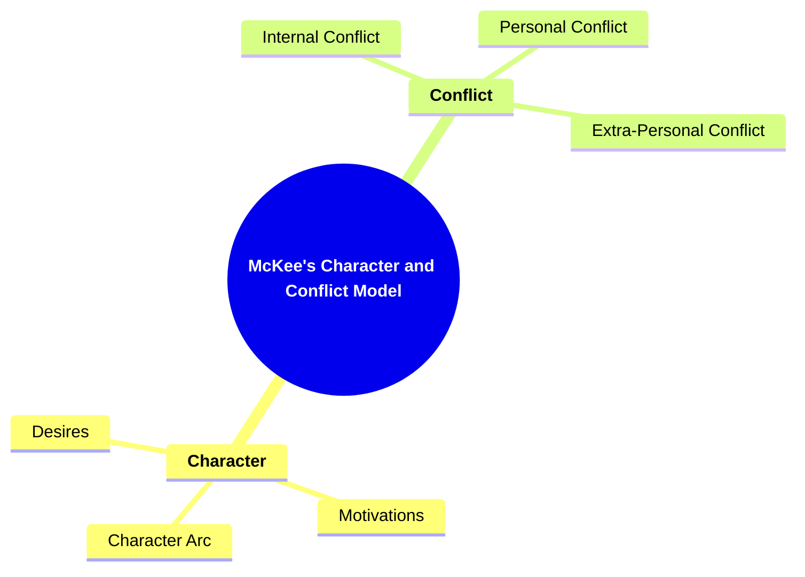
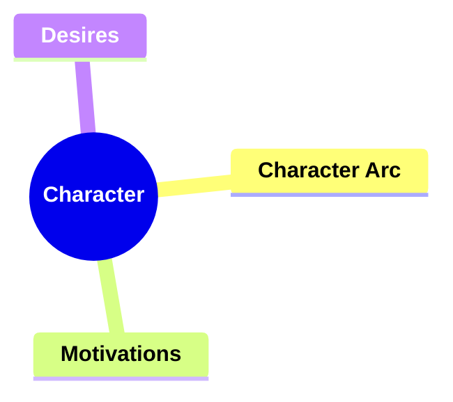
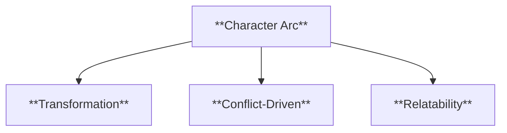
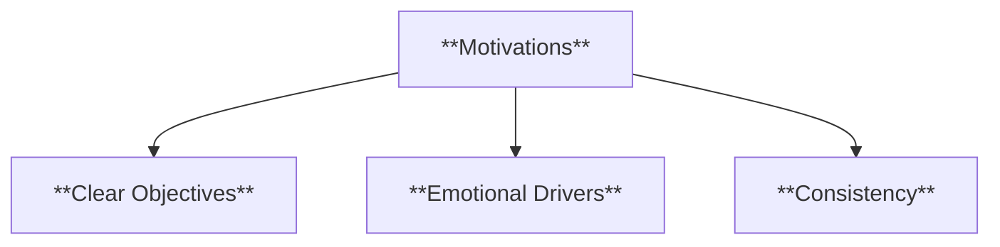
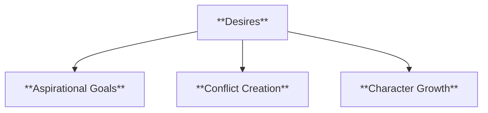
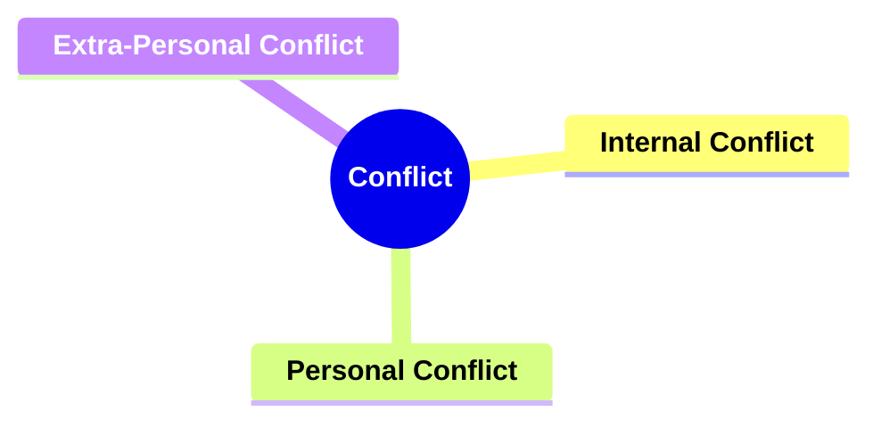
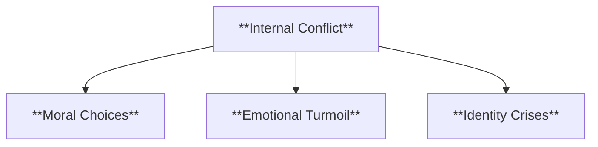
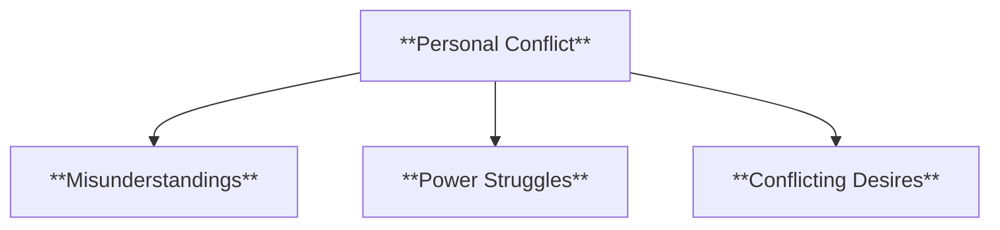
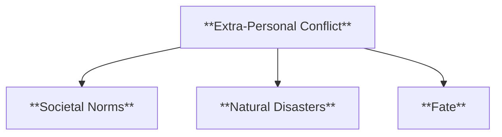
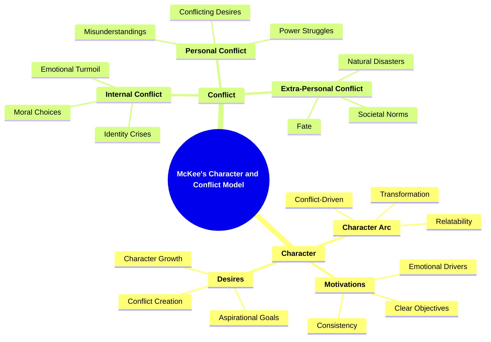

- [**1. Title: McKee's Character and Conflict Model**](#1-title-mckees-character-and-conflict-model)
  - [**1.1. Definition**](#11-definition)
- [**2. Key Concepts**](#2-key-concepts)
  - [**2.1. Character**](#21-character)
    - [**2.1.1. Components of Character**](#211-components-of-character)
      - [**2.1.1.1. Character Arc**](#2111-character-arc)
      - [**2.1.1.2. Motivations**](#2112-motivations)
      - [**2.1.1.3. Desires**](#2113-desires)
  - [**2.2. Conflict**](#22-conflict)
    - [**2.2.1. Components of Conflict**](#221-components-of-conflict)
      - [**2.2.1.1. Internal Conflict**](#2211-internal-conflict)
      - [**2.2.1.2. Personal Conflict**](#2212-personal-conflict)
      - [**2.2.1.3. Extra-Personal Conflict**](#2213-extra-personal-conflict)
- [**3. Implications of McKee's Character and Conflict Model**](#3-implications-of-mckees-character-and-conflict-model)
  - [**3.1. Enhanced Emotional and Psychological Depth**](#31-enhanced-emotional-and-psychological-depth)
  - [**3.2. Dynamic and Relatable Characters**](#32-dynamic-and-relatable-characters)
  - [**3.3. Multi-Dimensional Storytelling**](#33-multi-dimensional-storytelling)
- [**Core Components Overview**](#core-components-overview)

---

### **1. Title: McKee's Character and Conflict Model**

#### **1.1. Definition**

McKee's Character and Conflict Model emphasizes that **character** and **conflict** are the driving forces of storytelling. According to McKee, without compelling characters and meaningful conflicts, a story lacks the emotional and psychological depth necessary to engage audiences. This model provides a framework for writers to develop multi-dimensional characters and layered conflicts, ensuring that narratives are both emotionally resonant and intellectually stimulating.

---

### **2. Key Concepts**

Outline the primary concepts or components that make up the framework. These should be broad enough to accommodate various subjects.

#### **2.1. Character**

- **Definition:**
  Characters are the individuals who populate the story, each with distinct personalities, motivations, and development arcs. They are central to driving the narrative forward and fostering emotional connections with the audience.

##### **2.1.1. Components of Character**

###### **2.1.1.1. Character Arc**

- **Definition:**
  The protagonist’s transformation throughout the story, involving significant internal and external changes driven by the conflicts they encounter. A well-crafted character arc is crucial for creating a satisfying and relatable narrative.

- **Characteristics:**
  - **Transformation:** Significant internal and external changes that the protagonist undergoes.
  - **Conflict-Driven:** The character's transformation is a result of the conflicts they face.
  - **Relatability:** Creates a satisfying and relatable narrative that resonates with the audience.

- **Example:** In _The Godfather_, Michael Corleone’s arc from a reluctant outsider to a powerful mafia boss exemplifies profound character transformation.

---

###### **2.1.1.2. Motivations**

- **Definition:**
  The underlying reasons that drive a character's actions and decisions throughout the story. Motivations provide purpose and direction, influencing how characters respond to conflicts and challenges.

- **Characteristics:**
  - **Clear Objectives:** Defines what the character aims to achieve.
  - **Emotional Drivers:** Emotional reasons that compel the character to act.
  - **Consistency:** Motivations remain consistent, guiding character behavior logically.

---

###### **2.1.1.3. Desires**

- **Definition:**
  The specific goals or aspirations that a character seeks to fulfill. Desires often create the impetus for the character's journey and the story's central conflicts.

- **Characteristics:**
  - **Aspirational Goals:** Specific outcomes the character strives to achieve.
  - **Conflict Creation:** Desires can lead to conflicts when they clash with obstacles or other characters.
  - **Character Growth:** Pursuing desires facilitates character development and transformation.

- **Example:** In _The Shawshank Redemption_, Andy Dufresne’s desire for freedom drives his actions and ultimate escape.

---

#### **2.2. Conflict**

- **Definition:**
  Conflicts are the challenges and obstacles that drive the narrative, providing emotional and psychological depth to the story. They are essential for character development and maintaining audience engagement.

##### **2.2.1. Components of Conflict**

###### **2.2.1.1. Internal Conflict**

- **Definition:**
  Personal struggles and psychological dilemmas faced by a character. Internal conflicts often revolve around moral choices, emotional turmoil, or identity crises.

- **Characteristics:**
  - **Moral Choices:** Struggles over right and wrong.
  - **Emotional Turmoil:** Inner emotional conflicts that affect the character's decisions.
  - **Identity Crises:** Questions about self and purpose that challenge the character's sense of identity.

- **Example:** Hamlet’s indecision and existential angst in Shakespeare’s _Hamlet_ highlight internal conflict.

---

###### **2.2.1.2. Personal Conflict**

- **Definition:**
  Interpersonal challenges and struggles between characters. Personal conflicts stem from misunderstandings, power struggles, or conflicting desires, creating tension and driving the plot forward.

- **Characteristics:**
  - **Misunderstandings:** Conflicts arising from lack of communication or differing perspectives.
  - **Power Struggles:** Competing for control, dominance, or authority.
  - **Conflicting Desires:** Characters wanting different things, leading to clashes.

- **Example:** The rivalry between Scarlett O’Hara and Melanie Hamilton in _Gone with the Wind_ showcases personal conflict.

---

###### **2.2.1.3. Extra-Personal Conflict**

- **Definition:**
  External forces that act upon the characters, such as societal norms, natural disasters, or fate. Extra-personal conflicts create obstacles that the characters must overcome, adding complexity to the narrative.

- **Characteristics:**
  - **Societal Norms:** Pressures and expectations imposed by society or culture.
  - **Natural Disasters:** Environmental challenges that threaten the characters.
  - **Fate:** Inevitability or destiny influencing the narrative's direction.

- **Example:** In _The Lord of the Rings_, the characters face the extra-personal conflict of battling the forces of Sauron.

---

### **3. Implications of McKee's Character and Conflict Model**

#### **3.1. Enhanced Emotional and Psychological Depth**

- **Description:**
  By focusing on character and conflict, McKee's model ensures that stories possess the emotional and psychological layers necessary to engage audiences deeply. Compelling characters and meaningful conflicts create a rich narrative that resonates on multiple levels.

#### **3.2. Dynamic and Relatable Characters**

- **Description:**
  Well-crafted character arcs allow audiences to connect deeply with characters, enhancing investment in their journeys and outcomes. Relatable characters with clear motivations and desires make the story more impactful and memorable.

#### **3.3. Multi-Dimensional Storytelling**

- **Description:**
  The categorization of conflicts into internal, personal, and extra-personal allows for complex and layered narratives. This complexity adds richness to the story, preventing it from becoming one-dimensional and fostering a more engaging and thought-provoking experience.

---

### **Core Components Overview**

- **Character**

  - Character Arc
  - Motivations
  - Desires

- **Conflict**
  - Internal Conflict
  - Personal Conflict
  - Extra-Personal Conflict

---

