- [1. **Title: Rimmon-Kenan's Characterization Framework**](#1-title-rimmon-kenans-characterization-framework)
- [2. **Key Concepts**](#2-key-concepts)
  - [2.1. **Direct Characterization**](#21-direct-characterization)
    - [2.1.1. **Components of Direct Characterization**](#211-components-of-direct-characterization)
      - [2.1.1.1. **Narrator-Provided**](#2111-narrator-provided)
      - [2.1.1.2. **Character-Provided**](#2112-character-provided)
  - [2.2. **Indirect Characterization**](#22-indirect-characterization)
    - [2.2.1. **Components of Indirect Characterization**](#221-components-of-indirect-characterization)
      - [2.2.1.1. **Action-Based**](#2211-action-based)
      - [2.2.1.2. **Dialogue-Based**](#2212-dialogue-based)
      - [2.2.1.3. **Thought-Based**](#2213-thought-based)
      - [2.2.1.4. **Interaction-Based**](#2214-interaction-based)
  - [2.3. **Narrative Voice**](#23-narrative-voice)
    - [2.3.1. **Components of Narrative Voice**](#231-components-of-narrative-voice)
      - [2.3.1.1. **Omniscient Narrator**](#2311-omniscient-narrator)
      - [2.3.1.2. **Limited Narrator**](#2312-limited-narrator)
      - [2.3.1.3. **Unreliable Narrator**](#2313-unreliable-narrator)
  - [2.4. **Focalization**](#24-focalization)
    - [2.4.1. **Components of Focalization**](#241-components-of-focalization)
      - [2.4.1.1. **Internal Focalization**](#2411-internal-focalization)
      - [2.4.1.2. **External Focalization**](#2412-external-focalization)
      - [2.4.1.3. **Variable Focalization**](#2413-variable-focalization)
- [3. Implications of **Characterization Framework**](#3-implications-of-characterization-framework)

---

### 1. **Title: Rimmon-Kenan's Characterization Framework**

**Characterization**:
**Definition**: Shlomith Rimmon-Kenan’s _Characterization Framework_ explores how authors construct characters in narrative fiction, using both explicit and implicit methods. These techniques shape how readers perceive and engage with characters, emphasizing the complexity of human traits and behaviors.

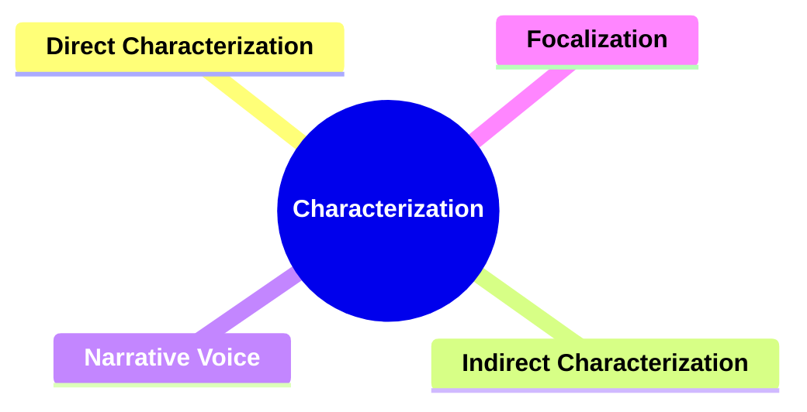

---

### 2. **Key Concepts**

#### 2.1. **Direct Characterization**

**Definition**:
Direct characterization involves explicit descriptions of a character's traits, appearance, and personality provided by the narrator or other characters.

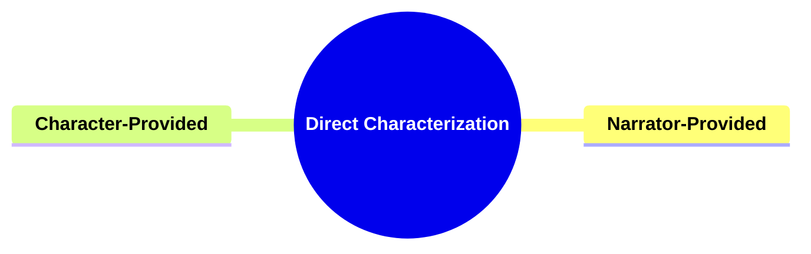

##### 2.1.1. **Components of Direct Characterization**

###### 2.1.1.1. **Narrator-Provided**

- **Definition**: Traits are given directly by the narrator, offering a clear-cut depiction of the character.

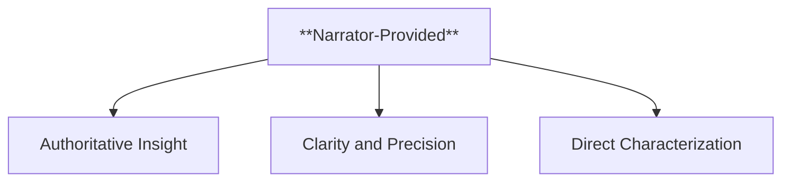

- **Characteristics**
  - **Authoritative Insight**: Offers an objective or omniscient perspective that provides readers with reliable information about the character.
  - **Clarity and Precision**: Ensures that character traits and motivations are conveyed clearly, helping readers understand their roles and significance.
  - **Direct Characterization**: Provides straightforward descriptions that leave little ambiguity, establishing the character’s identity and attributes efficiently.

---

###### 2.1.1.2. **Character-Provided**

- **Definition**: Traits described by other characters, which may reflect biases or personal interpretations.

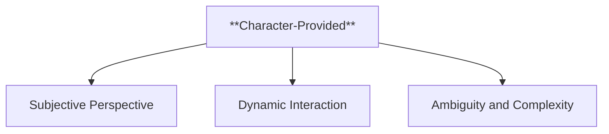

- **Characteristics**
  - **Subjective Perspective**: Adds layers to character portrayal, as descriptions are influenced by the speaker’s relationship, feelings, or biases.
  - **Dynamic Interaction**: Reveals character traits through interactions and dialogues, showcasing how characters are perceived within the story.
  - **Ambiguity and Complexity**: Can create an unreliable or multifaceted image of a character, as traits might be exaggerated, understated, or inaccurate.

---

#### 2.2. **Indirect Characterization**

**Definition**:
Indirect characterization reveals a character’s traits through their actions, speech, thoughts, and interactions with others, allowing readers to infer personality and motivations.

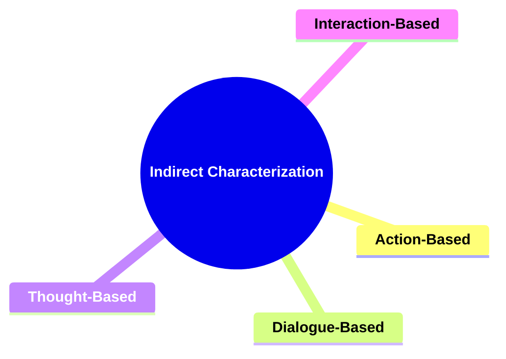

##### 2.2.1. **Components of Indirect Characterization**

###### 2.2.1.1. **Action-Based**

- **Definition**: Traits are revealed through what the character does, their choices, and behaviors.

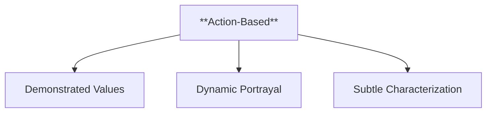

- **Characteristics**
  - **Demonstrated Values**: Shows the character’s morals, priorities, and strengths by their actions, reinforcing the saying "actions speak louder than words."
  - **Dynamic Portrayal**: Creates a sense of movement and development, allowing readers to understand the character through their responses to challenges.
  - **Subtle Characterization**: Provides indirect insight into traits, requiring readers to infer personality from behavior, adding depth to the narrative.

---

###### 2.2.1.2. **Dialogue-Based**

- **Definition**: The character’s way of speaking, word choice, and communication with others offers insights.

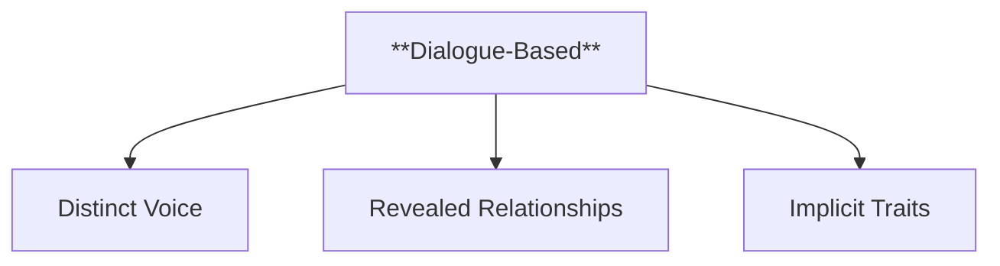

- **Characteristics**
  - **Distinct Voice**: Highlights unique traits through speech patterns, vocabulary, and tone, making the character memorable.
  - **Revealed Relationships**: Offers clues about the character’s status, emotions, and connections with others based on how they speak in different contexts.
  - **Implicit Traits**: Shows underlying traits, such as intelligence, humor, or temperament, through what is said and how it is expressed.

---

###### 2.2.1.3. **Thought-Based**

- **Definition**: Access to a character’s inner thoughts and emotions provides depth to their personality.

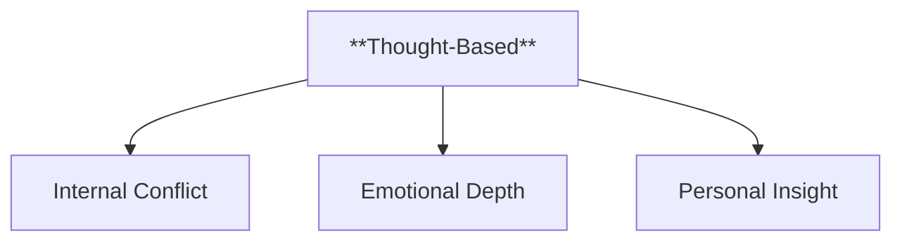

- **Characteristics**
  - **Internal Conflict**: Exposes struggles, fears, and desires that might not be evident through actions alone, adding complexity.
  - **Emotional Depth**: Allows readers to empathize with the character, understanding their motivations and vulnerabilities.
  - **Personal Insight**: Offers a direct line to the character’s perspective, providing context for their decisions and behavior.

---

###### 2.2.1.4. **Interaction-Based**

- **Definition**: How a character interacts with others, including non-verbal communication, reveals more about their role and personality.

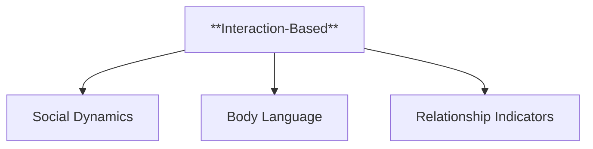

- **Characteristics**
  - **Social Dynamics**: Demonstrates the character’s ability to lead, follow, cooperate, or challenge, showing their role in the group.
  - **Body Language**: Adds nuance through non-verbal cues, such as gestures, facial expressions, and posture, which can hint at hidden emotions or intentions.
  - **Relationship Indicators**: Shows how the character’s behavior changes with different people, revealing traits such as loyalty, empathy, or authority.

---

#### 2.3. **Narrative Voice**

**Definition**:
Narrative voice refers to the voice telling the story, significantly influencing how characters are presented and perceived by the reader.

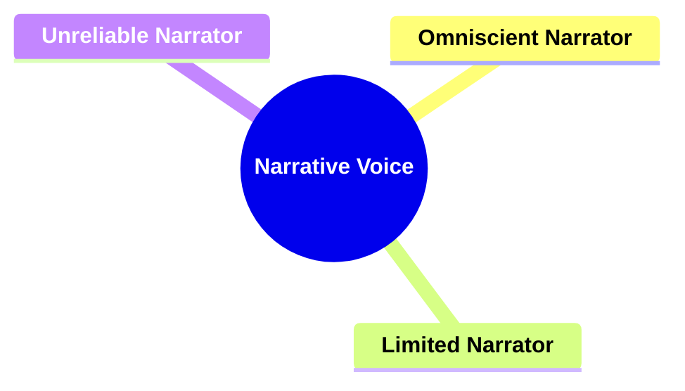

##### 2.3.1. **Components of Narrative Voice**

###### 2.3.1.1. **Omniscient Narrator**

- **Definition**: Provides an all-encompassing view of characters and events, often with access to multiple characters' thoughts and motivations.

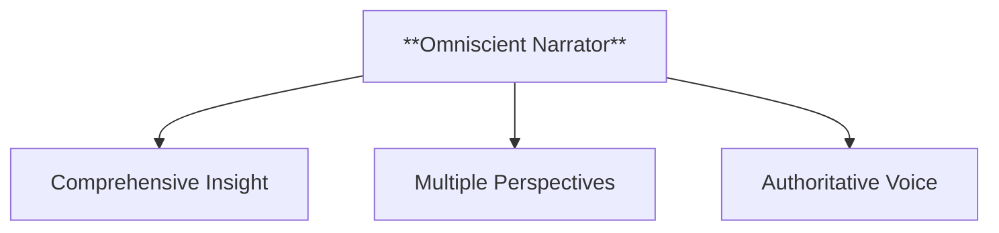

- **Characteristics**
  - **Comprehensive Insight**: Offers a broad understanding of the story world, giving readers detailed knowledge about various characters and events.
  - **Multiple Perspectives**: Allows the narrative to shift between different characters' viewpoints, enriching the story with diverse angles and experiences.
  - **Authoritative Voice**: Often conveys a sense of reliability and control, presenting information in a way that guides the reader’s interpretation of the story.

---

###### 2.3.1.2. **Limited Narrator**

- **Definition**: Offers a narrower, subjective view of the story, usually focused on a single character’s perspective.

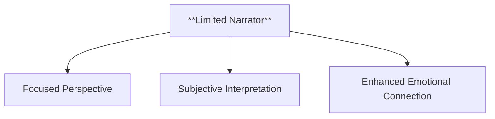

- **Characteristics**
  - **Focused Perspective**: Centers the narrative on one character’s experiences and thoughts, providing an intimate portrayal of their inner world.
  - **Subjective Interpretation**: Filters events through the lens of the chosen character, potentially limiting the reader's understanding to what that character knows or believes.
  - **Enhanced Emotional Connection**: Helps readers build a deeper emotional bond with the central character by sharing their personal thoughts and feelings.

---

###### 2.3.1.3. **Unreliable Narrator**

- **Definition**: A narrator whose credibility is questionable, often leading readers to question their depiction of events and characters.

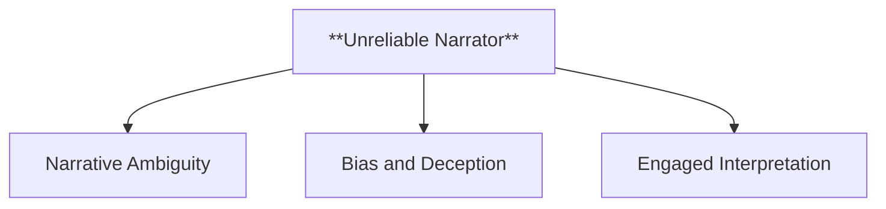

- **Characteristics**
  - **Narrative Ambiguity**: Creates uncertainty in the story, prompting readers to decipher what is true and what may be exaggerated or fabricated.
  - **Bias and Deception**: May intentionally or unintentionally present distorted views due to personal biases, mental state, or motivations.
  - **Engaged Interpretation**: Requires readers to actively assess the reliability of the narration, encouraging them to look for clues that reveal the truth behind the story.

---

#### 2.4. **Focalization**

**Definition**:
Focalization refers to the perspective through which the reader views the story, often aligning with a particular character’s point of view.

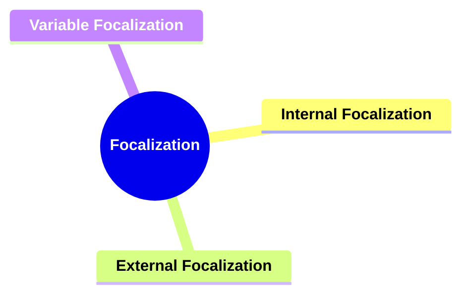

##### 2.4.1. **Components of Focalization**

###### 2.4.1.1. **Internal Focalization**

- **Definition**: The story is presented from within the mind of a character, offering subjective access to their thoughts and feelings.

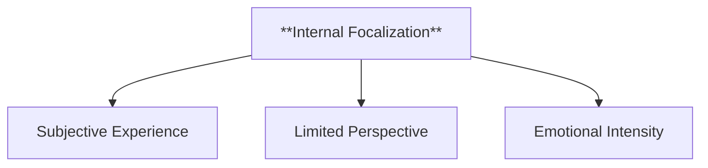

- **Characteristics**
  - **Subjective Experience**: Provides an intimate view of the character’s inner thoughts, emotions, and perceptions, allowing readers to connect deeply with them.
  - **Limited Perspective**: Restricts knowledge to what the character knows or believes, creating a potentially biased or incomplete view of the story world.
  - **Emotional Intensity**: Enhances the narrative’s emotional impact by revealing the character’s personal struggles, hopes, and fears directly to the reader.

---

###### 2.4.1.2. **External Focalization**

- **Definition**: The narrative provides an outside view, focusing only on observable actions and dialogue without access to inner thoughts.

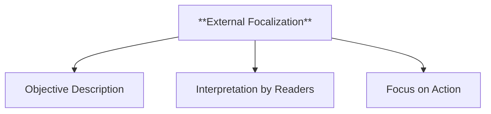

- **Characteristics**
  - **Objective Description**: Presents events and character actions without subjective insight, creating a detached and impartial narrative style.
  - **Interpretation by Readers**: Leaves it to the readers to infer characters’ emotions and motivations based on their behavior and spoken words.
  - **Focus on Action**: Emphasizes what characters do and say rather than what they think or feel, creating a narrative driven by external events.

---

###### 2.4.1.3. **Variable Focalization**

- **Definition**: The focalization shifts between different characters, offering multiple perspectives within the same narrative.

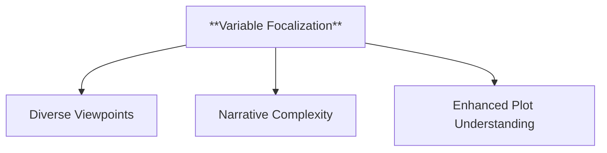

- **Characteristics**
  - **Diverse Viewpoints**: Provides insights into the thoughts and experiences of different characters, enriching the story by presenting contrasting perspectives.
  - **Narrative Complexity**: Adds depth to the story by showing how various characters perceive and respond to the same events in different ways.
  - **Enhanced Plot Understanding**: Allows readers to gain a fuller picture of the narrative by revealing information that one character alone might not possess.

---

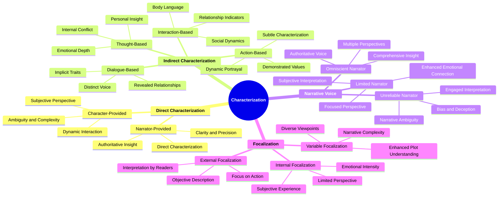

---

### 3. Implications of **Characterization Framework**

**Reader Engagement**:
Rimmon-Kenan’s framework emphasizes how direct and indirect characterization, narrative voice, and focalization contribute to deeper reader engagement. These elements work together to shape the reader’s understanding of characters and the narrative as a whole.

**Narrative Structure**:
The interaction between characterization techniques, narrative voice, and focalization reveals how stories guide the reader’s emotional and intellectual responses. Analyzing these elements provides insight into the complexity of characters and their roles in the narrative.

---
