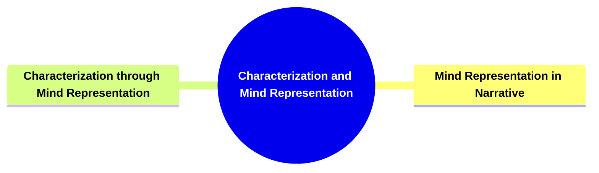
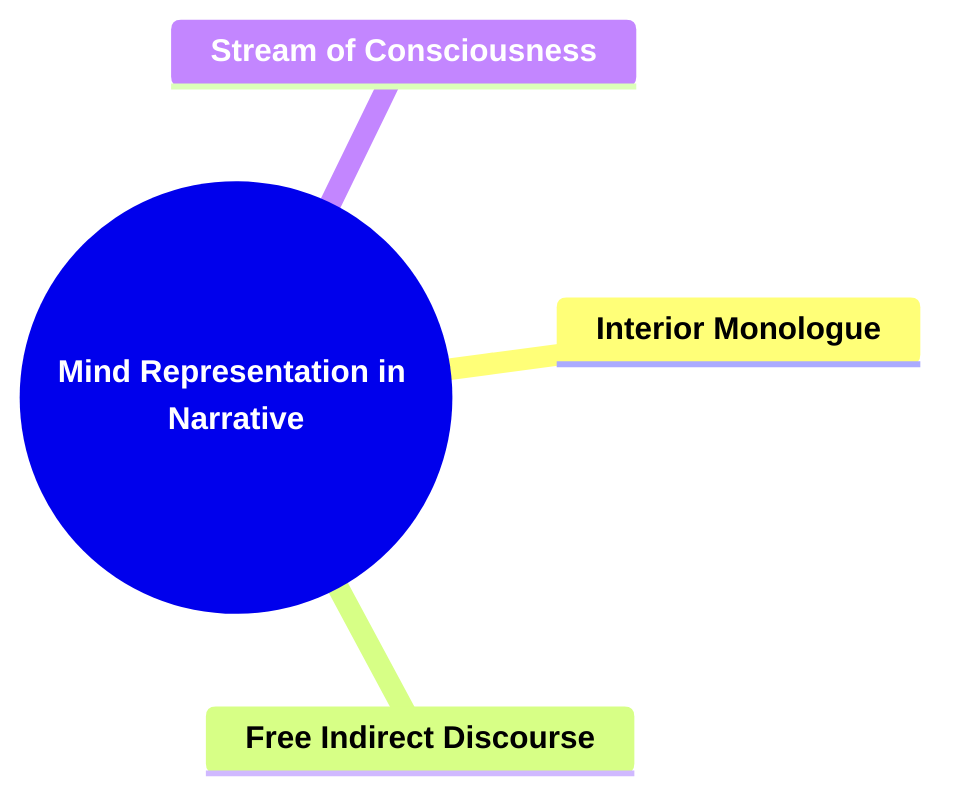
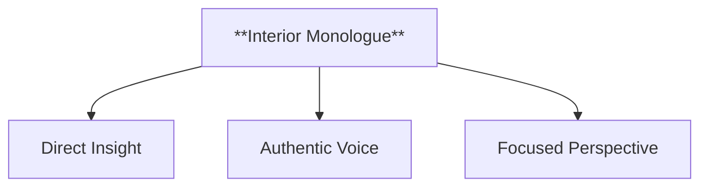
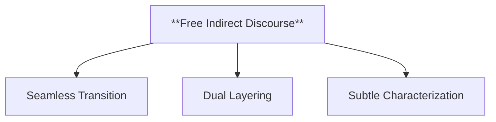
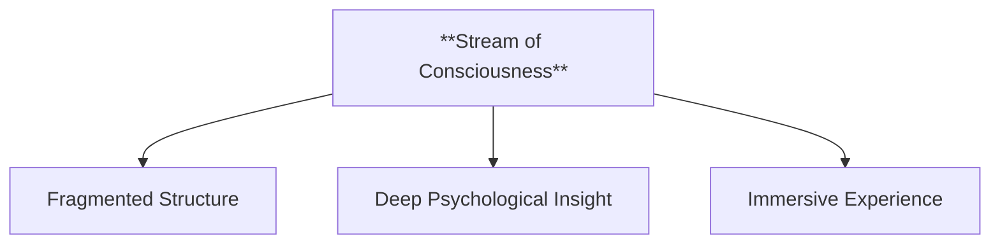
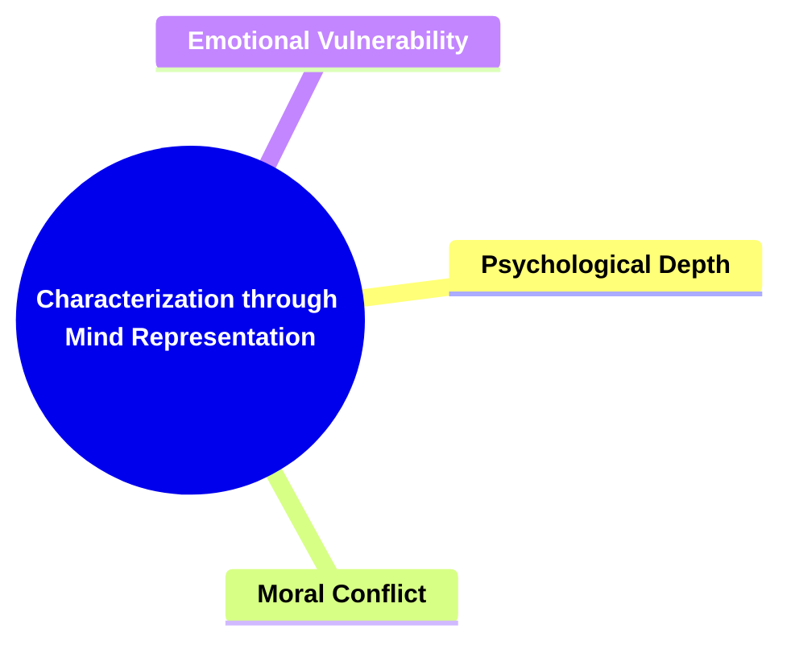
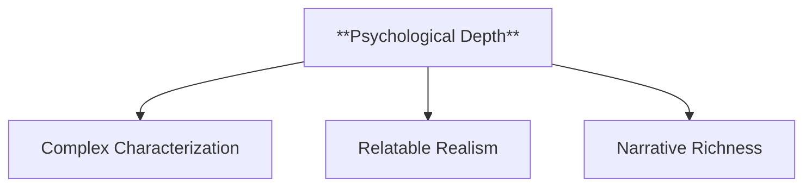
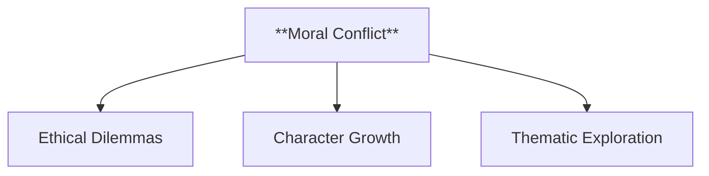
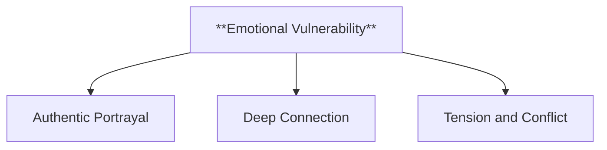
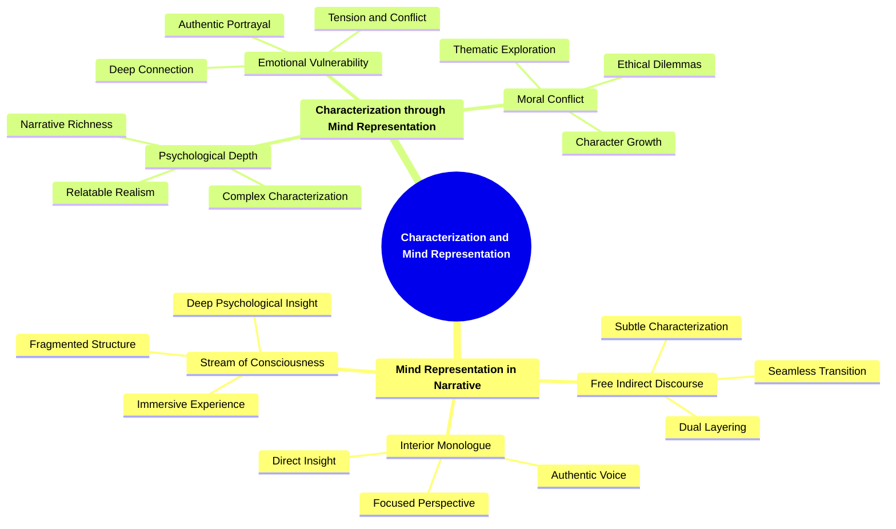

- [1. **Title: Herman's Characterization and Mind Representation Framework**](#1-title-hermans-characterization-and-mind-representation-framework)
- [2. **Key Concepts**](#2-key-concepts)
  - [2.1. **Mind Representation in Narrative**](#21-mind-representation-in-narrative)
    - [2.1.1. **Components of Mind Representation in Narrative**](#211-components-of-mind-representation-in-narrative)
      - [2.1.1.1. **Interior Monologue**](#2111-interior-monologue)
      - [2.1.1.2. **Free Indirect Discourse**](#2112-free-indirect-discourse)
      - [2.1.1.3. **Stream of Consciousness**](#2113-stream-of-consciousness)
  - [2.2. **Characterization through Mind Representation**](#22-characterization-through-mind-representation)
    - [2.2.1. **Components of Characterization through Mind Representation**](#221-components-of-characterization-through-mind-representation)
      - [2.2.1.1. **Psychological Depth**](#2211-psychological-depth)
      - [2.2.1.2. **Moral Conflict**](#2212-moral-conflict)
      - [2.2.1.3. **Emotional Vulnerability**](#2213-emotional-vulnerability)
- [3. Theoretical Significance](#3-theoretical-significance)

---

### 1. **Title: Herman's Characterization and Mind Representation Framework**

**Characterization and Mind Representation**:
**Definition**: David Herman’s framework explores how narratives depict the mental states, intentions, and emotions of characters, bridging narratology and cognitive science. It provides insights into how stories simulate human consciousness, allowing readers to engage with characters on a psychological level. Herman’s work is crucial for analyzing the techniques authors use to represent characters' inner lives and how these portrayals influence reader perception, interpretation, and empathy.

---

### 2. **Key Concepts**

#### 2.1. **Mind Representation in Narrative**

**Definition**:
Mind representation refers to the narrative techniques used to depict the inner thoughts, emotions, and motivations of characters. These techniques allow readers to access characters' mental and emotional states, deepening engagement with the narrative.

##### 2.1.1. **Components of Mind Representation in Narrative**

###### 2.1.1.1. **Interior Monologue**

- **Definition**: Direct presentation of a character’s thoughts, mimicking internal dialogue.

- **Characteristics**
  - **Direct Insight**: Provides readers with immediate access to a character’s thoughts, creating a strong connection between the reader and the character.
  - **Authentic Voice**: Mimics the natural flow of thinking, often using first-person language to make the thoughts feel personal and genuine.
  - **Focused Perspective**: Limits the narrative to the character’s point of view, revealing their internal conflicts, desires, and emotions.

---

###### 2.1.1.2. **Free Indirect Discourse**

- **Definition**: Blends the character’s thoughts with the narrator’s voice, offering a dual perspective.

- **Characteristics**
  - **Seamless Transition**: Moves smoothly between the character’s voice and the narrator’s voice, allowing for subtle shifts in perspective.
  - **Dual Layering**: Combines the intimacy of first-person thought with the narrative scope of third-person storytelling, creating a rich and nuanced point of view.
  - **Subtle Characterization**: Provides insight into a character’s mindset while maintaining the narrative’s objectivity, enhancing depth without breaking the narrative flow.

---

###### 2.1.1.3. **Stream of Consciousness**

- **Definition**: Captures the continuous, often fragmented flow of a character’s thoughts, reflecting the complexity of human consciousness.

- **Characteristics**
  - **Fragmented Structure**: Mimics the natural, non-linear progression of thoughts, often jumping between ideas, memories, and observations without clear transitions.
  - **Deep Psychological Insight**: Offers an unfiltered look into a character’s mind, revealing complex emotions, subconscious thoughts, and associations.
  - **Immersive Experience**: Engages the reader in a character’s inner world, creating a sense of immediacy and raw, unstructured authenticity.

---

#### 2.2. **Characterization through Mind Representation**

**Definition**:
Characterization through mind representation involves using narrative techniques to convey the psychological depth of characters. This method builds characters that feel real and relatable by revealing their internal thoughts, desires, conflicts, and moral dilemmas.

##### 2.2.1. **Components of Characterization through Mind Representation**

###### 2.2.1.1. **Psychological Depth**

- **Definition**: Characters’ inner thoughts and emotions are explored in detail, adding complexity.

- **Characteristics**
  - **Complex Characterization**: Reveals the intricacies of a character’s mind, showcasing their motivations, fears, and desires.
  - **Relatable Realism**: Portrays characters in a way that mirrors real human behavior, making them multi-dimensional and believable.
  - **Narrative Richness**: Enhances the plot by intertwining external actions with internal reflections, adding layers to the storytelling.

---

###### 2.2.1.2. **Moral Conflict**

- **Definition**: Representation of characters’ internal moral struggles, creating a layered portrayal.

- **Characteristics**
  - **Ethical Dilemmas**: Presents situations where characters must choose between conflicting values or principles, highlighting their values and beliefs.
  - **Character Growth**: Allows for development as characters wrestle with their decisions, leading to personal transformation or resolution.
  - **Thematic Exploration**: Reinforces central themes by demonstrating how characters navigate complex moral landscapes, often influencing the story’s message.

---

###### 2.2.1.3. **Emotional Vulnerability**

- **Definition**: Characters’ feelings and fears are laid bare, fostering relatability and empathy.

- **Characteristics**
  - **Authentic Portrayal**: Shows characters in moments of weakness or honesty, making them more human and approachable.
  - **Deep Connection**: Engages readers emotionally by exposing the character’s true feelings, encouraging empathy and understanding.
  - **Tension and Conflict**: Creates opportunities for narrative tension, as characters face their fears or insecurities in the face of challenges.

---

---

### 3. Theoretical Significance

**Impact on Narrative Theory**:
Herman’s framework has influenced both narratology and cognitive science by offering a systematic way to analyze how narratives depict consciousness and inner life. It highlights how narrative techniques shape readers' understanding of characters’ minds and contributes to a deeper comprehension of character-driven stories.

**Application Across Media**:
This framework is applicable across various narrative forms, including literature, film, and theater, where the portrayal of mental states is central to character development. It provides tools for understanding how characters’ inner lives are constructed across different media and genres.

**Supporting Information**:

- **Interdisciplinary Influence**: Herman’s work bridges narrative theory and cognitive studies, offering insights into human cognition and empathy. It is particularly relevant in exploring how readers interpret characters' minds and motivations based on narrative cues.
- **Critiques and Further Development**: Some critics suggest that mind representation can sometimes overwhelm other aspects of narrative structure, such as plot. However, Herman’s framework has been expanded upon to integrate mind representation with broader narrative techniques, providing a comprehensive approach to understanding character psychology in storytelling.

---
