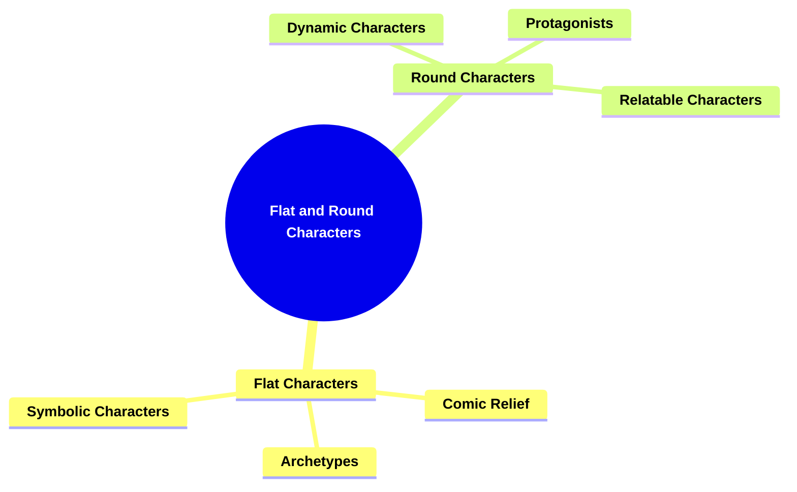
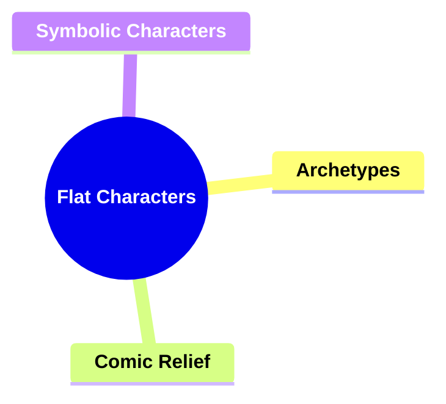
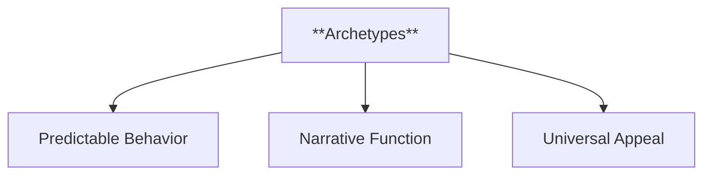
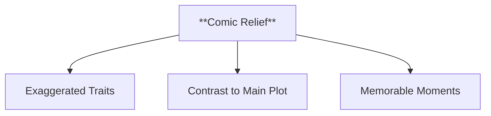
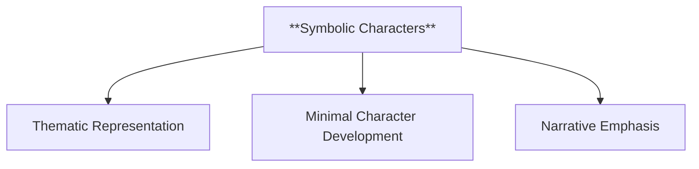
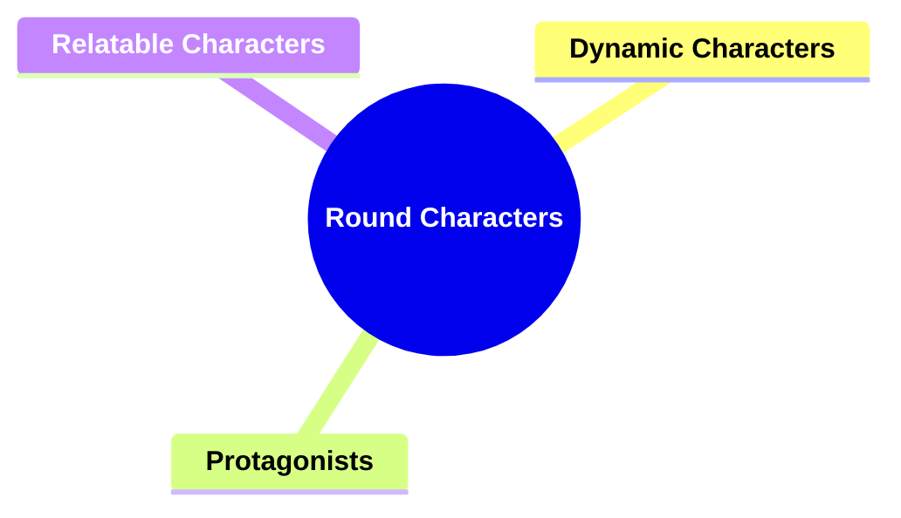
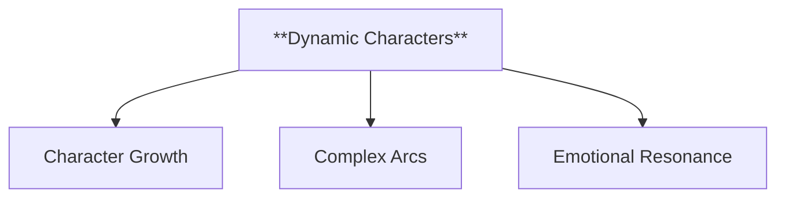
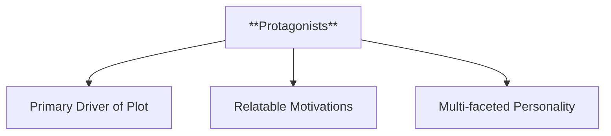
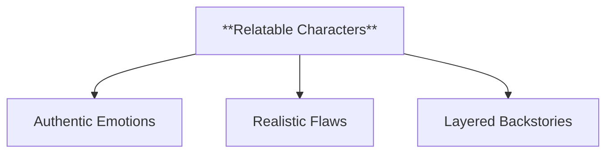
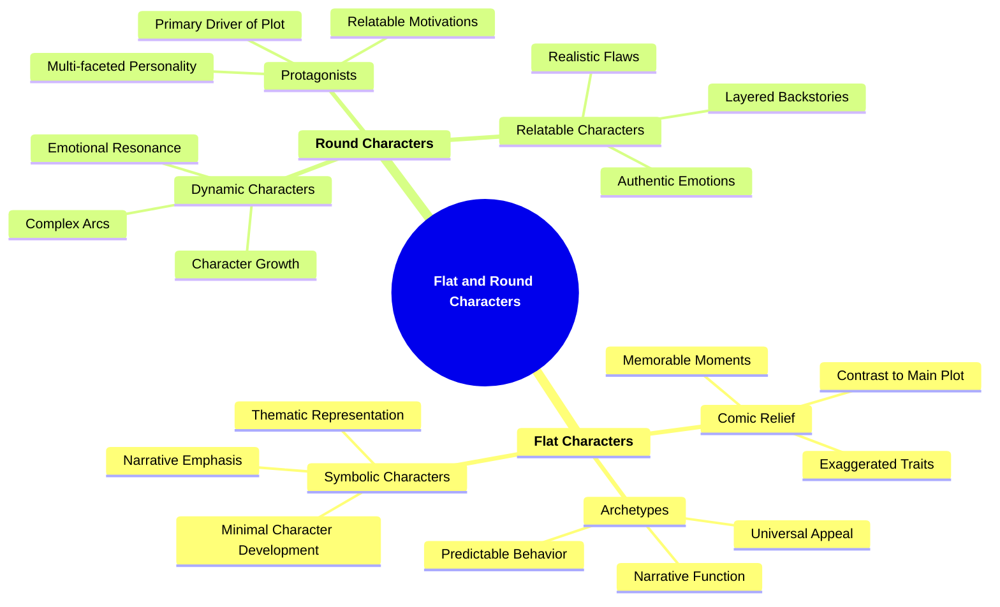

- [1. **Title: Forster's Flat and Round Characters Model**](#1-title-forsters-flat-and-round-characters-model)
- [2. **Key Concepts**](#2-key-concepts)
  - [2.1. **Flat Characters**](#21-flat-characters)
    - [2.1.1. **Components of Flat Characters**](#211-components-of-flat-characters)
      - [**Archetypes**](#archetypes)
      - [**Comic Relief**](#comic-relief)
      - [**Symbolic Characters**](#symbolic-characters)
  - [2.2. **Round Characters**](#22-round-characters)
    - [2.2.1. **Components of Round Characters**](#221-components-of-round-characters)
      - [**Dynamic Characters**](#dynamic-characters)
      - [**Protagonists**](#protagonists)
      - [**Relatable Characters**](#relatable-characters)
    - [2.2.2. Implications of Forster's Flat and Round Characters Model](#222-implications-of-forsters-flat-and-round-characters-model)

---

### 1. **Title: Forster's Flat and Round Characters Model**

**Flat and Round Characters**:
**Definition**: E.M. Forster, in his work _Aspects of the Novel_ (1927), introduces the concepts of _flat_ and _round_ characters to differentiate types of character development in narratives. This model helps in understanding the roles characters play in the story and their contribution to its overall impact. Forster’s framework remains foundational in literary studies, offering tools for analyzing character complexity and narrative dynamics.

---

### 2. **Key Concepts**

#### 2.1. **Flat Characters**

**Definition**:
Flat characters are simple, one-dimensional figures defined by a single trait or characteristic. They do not undergo significant development or change throughout the story and often remain static from beginning to end.

##### 2.1.1. **Components of Flat Characters**

###### **Archetypes**

- **Definition**: Flat characters often embody stereotypes or fixed traits, serving specific roles within the narrative.

- **Characteristics**
  - **Predictable Behavior**: Display consistent, recognizable traits that align with well-known character types, making them familiar to the audience.
  - **Narrative Function**: Serve specific purposes such as hero, mentor, or villain, driving the story forward through their established roles.
  - **Universal Appeal**: Tap into collective cultural or psychological symbols, resonating with readers by representing fundamental human experiences or motifs.

---

###### **Comic Relief**

- **Definition**: Flat characters can provide humor through their exaggerated traits.

- **Characteristics**
  - **Exaggerated Traits**: Use heightened or caricatured characteristics to create humor and lighten the tone of the narrative.
  - **Contrast to Main Plot**: Offer a break from intense or serious scenes, balancing the emotional weight of the story.
  - **Memorable Moments**: Create standout moments that add levity, making the character and their actions enjoyable and easy to recall.

---

###### **Symbolic Characters**

- **Definition**: They may represent ideas or themes without the need for deep exploration.

- **Characteristics**
  - **Thematic Representation**: Embody abstract concepts such as justice, greed, or innocence, reinforcing the story's themes.
  - **Minimal Character Development**: Require little backstory or depth, as their primary function is to symbolize an idea rather than evolve.
  - **Narrative Emphasis**: Draw attention to particular messages or themes, emphasizing the broader implications of the story through their presence.

---

#### 2.2. **Round Characters**

**Definition**:
Round characters are complex, multi-dimensional figures who grow and change over the course of the narrative. They exhibit a range of emotions, motivations, and behaviors, making them more realistic and relatable.

##### 2.2.1. **Components of Round Characters**

###### **Dynamic Characters**

- **Definition**: Characters who undergo significant change in response to events or internal struggles.

- **Characteristics**
  - **Character Growth**: Experience meaningful transformation, whether through personal realizations, shifts in values, or overcoming challenges.
  - **Complex Arcs**: Follow multi-dimensional development that reflects the impact of the plot, making their journey engaging and believable.
  - **Emotional Resonance**: Evoke empathy by showcasing a realistic process of change that readers can relate to or be inspired by.

---

###### **Protagonists**

- **Definition**: Often the central figures in a narrative, driving the story’s emotional and thematic development.

- **Characteristics**
  - **Primary Driver of Plot**: Push the story forward through their actions, decisions, and conflicts, forming the backbone of the narrative.
  - **Relatable Motivations**: Possess goals, desires, or struggles that readers can connect with, deepening their emotional investment.
  - **Multi-faceted Personality**: Display a range of traits and emotions, making them well-rounded and able to carry the story’s thematic weight.

---

###### **Relatable Characters**

- **Definition**: Those whose depth and complexity mirror real human experiences.

- **Characteristics**
  - **Authentic Emotions**: Exhibit reactions and emotions that resonate with readers, fostering a sense of connection and understanding.
  - **Realistic Flaws**: Have imperfections that make them more human, allowing readers to see themselves in the character’s struggles.
  - **Layered Backstories**: Possess detailed histories and motivations that inform their behavior and decisions, adding credibility to their actions.

---

---

##### 2.2.2. Implications of Forster's Flat and Round Characters Model

**Impact on Literary Theory**:
Forster’s model has shaped the way character development is analyzed in literary studies. His distinction between flat and round characters offers a useful framework for understanding how different types of characters contribute to the narrative's structure and emotional depth.

**Collaborative or Future-Oriented Insight**:
This model remains applicable across literature, theater, and film, providing a lens through which to analyze character complexity. Round and flat characters continue to be central in discussions of narrative construction, offering insight into how different character types serve thematic and structural purposes.

---

- **Theoretical Significance**:
  - **Impact on Character Analysis**: Forster’s distinction between flat and round characters has had a lasting impact on literary analysis, providing a foundational tool for understanding character construction and its role in narrative fiction. His model helps critics and readers alike to categorize characters and analyze how their complexity—or lack thereof—contributes to the overall narrative.
  - **Application in Various Genres**: While Forster’s concepts are widely applicable across all genres, they are particularly relevant in literary fiction, where character development is often a primary focus. However, the model is also useful in understanding character roles in genre fiction, where flat characters may be more common due to the emphasis on plot and theme.
  - **Supporting Information**:
    - **Literary Criticism and Beyond**: Forster’s model has been influential not only in literary criticism but also in areas such as screenwriting and character design in visual media. Understanding the balance between flat and round characters is essential for creating narratives that are both compelling and thematically coherent.
    - **Critiques and Evolution**: Some critics argue that Forster’s binary distinction oversimplifies character development, suggesting that characters can exhibit traits of both flat and round types. Additionally, contemporary narratives, especially in postmodern literature, often blur these boundaries, creating characters that defy easy categorization. Despite these critiques, Forster’s model remains a key concept in the study of narrative and character development.
