- [1. **Title: Bal's Narrative Agents Framework**](#1-title-bals-narrative-agents-framework)
- [2. **Key Concepts**](#2-key-concepts)
  - [2.1. **Narrator**](#21-narrator)
    - [2.1.1. **Components of Narrator**](#211-components-of-narrator)
      - [2.1.1.1. **First-Person Narrator**](#2111-first-person-narrator)
      - [2.1.1.2. **Third-Person Narrator**](#2112-third-person-narrator)
      - [2.1.1.3. **Reliable Narrator**](#2113-reliable-narrator)
      - [2.1.1.4. **Unreliable Narrator**](#2114-unreliable-narrator)
  - [2.2. **Focalizer**](#22-focalizer)
    - [2.2.1. **Components of Focalizer**](#221-components-of-focalizer)
      - [2.2.1.1. **Internal Focalizer**](#2211-internal-focalizer)
      - [2.2.1.2. **External Focalizer**](#2212-external-focalizer)
      - [2.2.1.3. **Variable Focalization**](#2213-variable-focalization)
  - [2.3. **Actor**](#23-actor)
    - [2.3.1. **Components of Actor**](#231-components-of-actor)
      - [2.3.1.1. **Protagonist**](#2311-protagonist)
      - [2.3.1.2. **Antagonist**](#2312-antagonist)
      - [2.3.1.3. **Supporting Actor**](#2313-supporting-actor)
- [3. Implications of Narrative Agents](#3-implications-of-narrative-agents)

---

### 1. **Title: Bal's Narrative Agents Framework**

**Narrative Agents**:
**Definition**: Mieke Bal’s _Narrative Agents Framework_ identifies the key participants involved in the construction, delivery, and interpretation of a narrative. These agents include the narrator, focalizer, and actor, each of which plays a distinct role in shaping the narrative’s presentation and meaning. Understanding these agents is crucial for analyzing how stories are structured and conveyed to the audience.

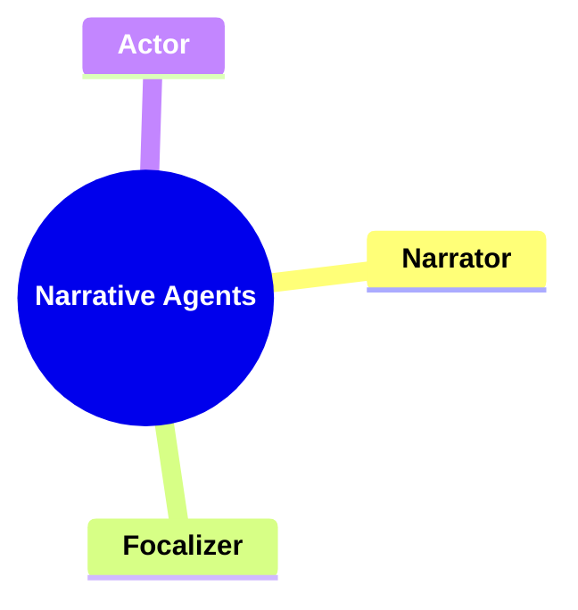

---

### 2. **Key Concepts**

#### 2.1. **Narrator**

**Definition**:
The narrator is the agent responsible for recounting the story. Bal distinguishes between first-person narrators, who are characters within the story, and third-person narrators, who are external to the events. Narrators can also be categorized as reliable or unreliable, depending on whether their account is trustworthy.

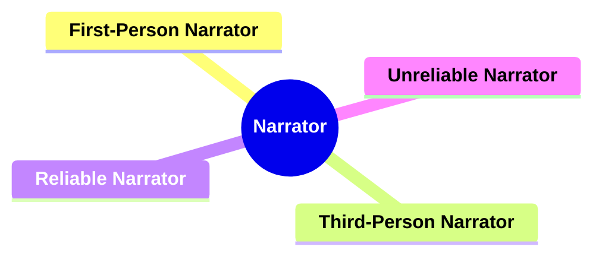

##### 2.1.1. **Components of Narrator**

###### 2.1.1.1. **First-Person Narrator**

- **Definition**: A character within the story narrating events from their perspective.

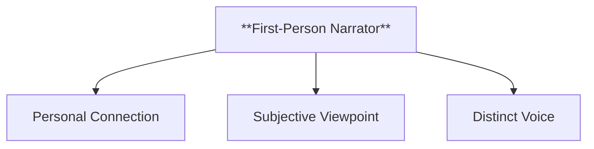

- **Characteristics**
  - **Personal Connection**: Creates an intimate bond between the narrator and the reader.
  - **Subjective Viewpoint**: Provides a limited, biased perspective.
  - **Distinct Voice**: Showcases the character’s unique tone and thoughts.

---

###### 2.1.1.2. **Third-Person Narrator**

- **Definition**: An external agent telling the story from outside the events.

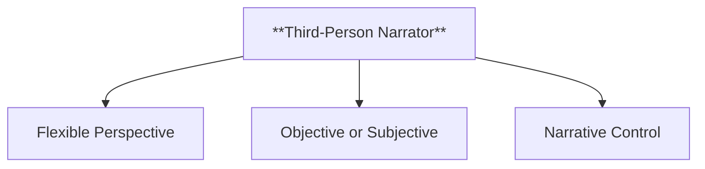

- **Characteristics**
  - **Flexible Perspective**: Can switch between multiple characters’ points of view.
  - **Objective or Subjective**: May reflect characters' thoughts and emotions.
  - **Narrative Control**: Describes scenes beyond characters' awareness.

---

###### 2.1.1.3. **Reliable Narrator**

- **Definition**: A narrator whose version of events is credible and trustworthy.

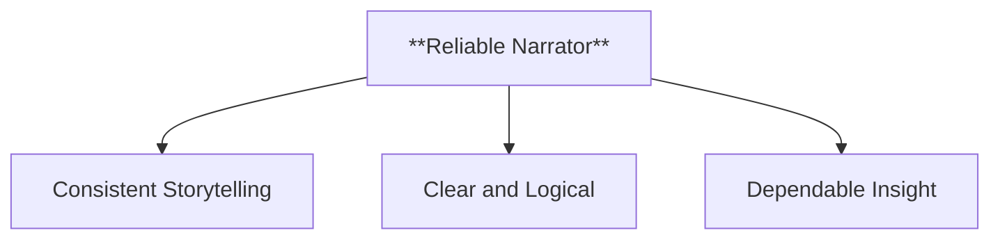

- **Characteristics**
  - **Consistent Storytelling**: Provides a believable account.
  - **Clear and Logical**: Events align with known facts.
  - **Dependable Insight**: Readers trust the narrative.

---

###### 2.1.1.4. **Unreliable Narrator**

- **Definition**: A narrator whose account may be biased or misleading.

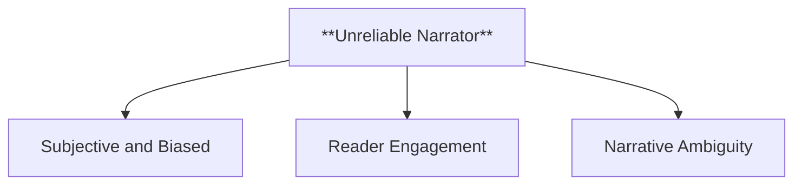

- **Characteristics**
  - **Subjective and Biased**: Skewed due to motives or emotions.
  - **Reader Engagement**: Encourages active interpretation.
  - **Narrative Ambiguity**: Challenges the authenticity of events.

---

#### 2.2. **Focalizer**

**Definition**:
The focalizer is the agent through whose perspective the events of the story are perceived. Focalization differs from narration in that it focuses on who sees the events, rather than who narrates them.

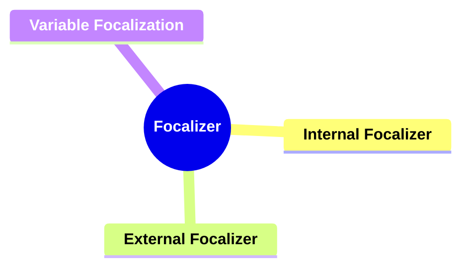

##### 2.2.1. **Components of Focalizer**

###### 2.2.1.1. **Internal Focalizer**

- **Definition**: A character within the story whose perspective shapes the presentation of events.

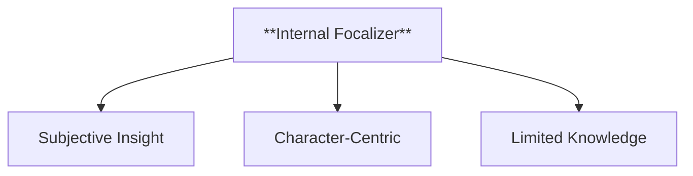

- **Characteristics**
  - **Subjective Insight**: Narrative filtered through character’s perceptions.
  - **Character-Centric**: Focuses on how events affect the focal character.
  - **Limited Knowledge**: Restricts understanding to focal character's knowledge.

---

###### 2.2.1.2. **External Focalizer**

- **Definition**: An outside observer presenting events from a detached perspective.

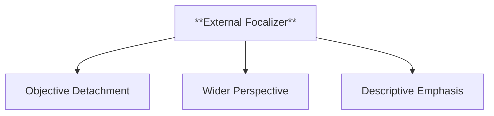

- **Characteristics**
  - **Objective Detachment**: Provides impartial account of events.
  - **Wider Perspective**: Beyond any single character’s awareness.
  - **Descriptive Emphasis**: Focuses on action over internal thoughts.

---

###### 2.2.1.3. **Variable Focalization**

- **Definition**: Shifts focalization between multiple characters or perspectives.

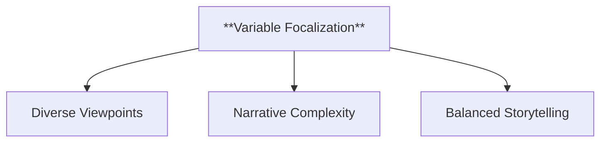

- **Characteristics**
  - **Diverse Viewpoints**: Presents different characters’ perspectives.
  - **Narrative Complexity**: Shows differing interpretations of events.
  - **Balanced Storytelling**: Ensures a richer narrative experience.

---

#### 2.3. **Actor**

**Definition**:
Actors are the characters or entities that perform actions within the narrative. Their decisions, motivations, and interactions drive the plot forward.

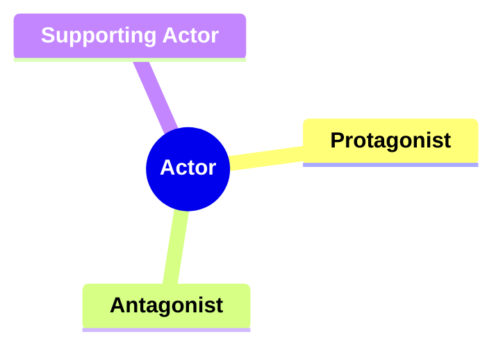

##### 2.3.1. **Components of Actor**

###### 2.3.1.1. **Protagonist**

- **Definition**: The main actor driving the narrative’s central conflict.

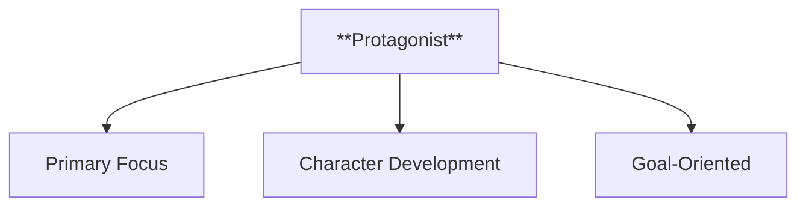

- **Characteristics**
  - **Primary Focus**: Central to the story.
  - **Character Development**: Typically undergoes growth.
  - **Goal-Oriented**: Propels the plot forward.

---

###### 2.3.1.2. **Antagonist**

- **Definition**: The opposing actor creating obstacles for the protagonist.

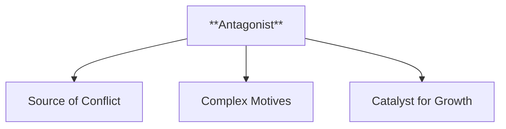

- **Characteristics**
  - **Source of Conflict**: Challenges the protagonist’s progress.
  - **Complex Motives**: Often has compelling goals.
  - **Catalyst for Growth**: Pushes protagonist to adapt.

---

###### 2.3.1.3. **Supporting Actor**

- **Definition**: Characters who assist the protagonist or antagonist.

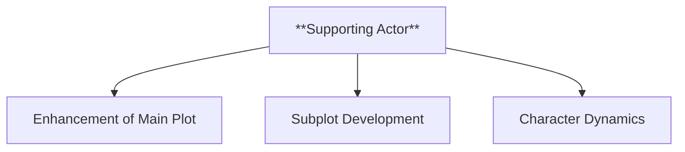

- **Characteristics**
  - **Enhancement of Main Plot**: Supports the primary narrative.
  - **Subplot Development**: Involved in side stories.
  - **Character Dynamics**: Provides insight through interactions.

---

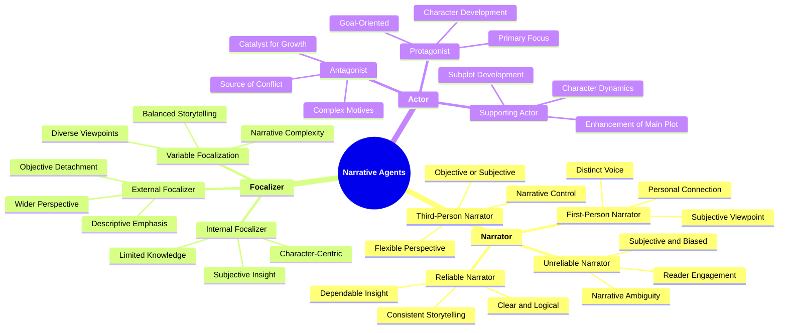

---

### 3. Implications of Narrative Agents

**Impact on Narrative Theory**:
Bal’s _Narrative Agents Framework_ enhances the ability to dissect complex narratives by offering a detailed approach to understanding the different participants involved in storytelling. It provides insights into how narrators, focalizers, and actors influence the reader’s perception and interpretation of the story.

**Application Across Genres and Media**:
This framework applies across various narrative forms, from literature to film and digital media. In film, for instance, voice-over narration and point-of-view shots align with the roles of narrator and focalizer, offering a way to analyze how stories are told visually.

**Supporting Information**:

- **Interdisciplinary Influence**: Bal’s framework has influenced fields such as film studies, psychology, and communication by analyzing how stories are constructed and how audiences engage with them.
- **Critiques and Further Development**: Some critics argue that distinguishing between narrator, focalizer, and actor can be challenging in complex narratives. However, Bal’s framework remains a valuable tool for understanding how stories function across various media.

---
